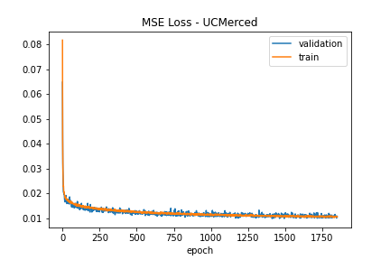
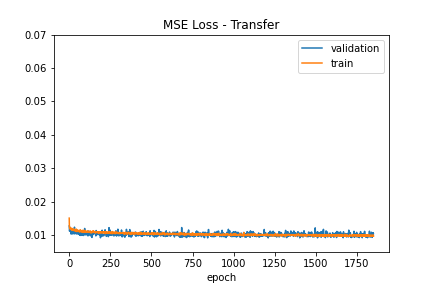
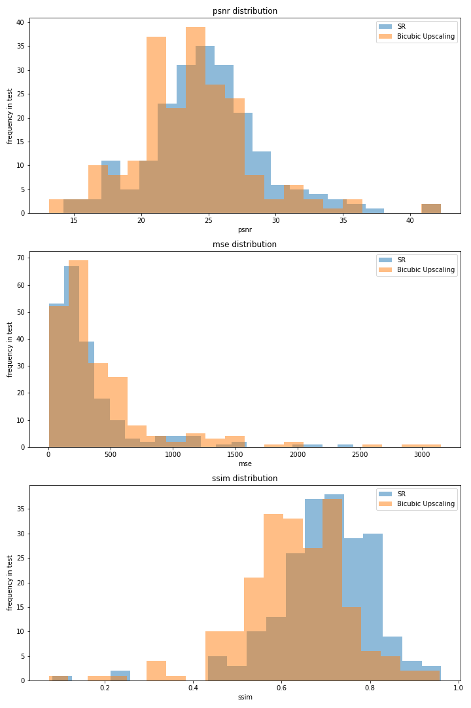
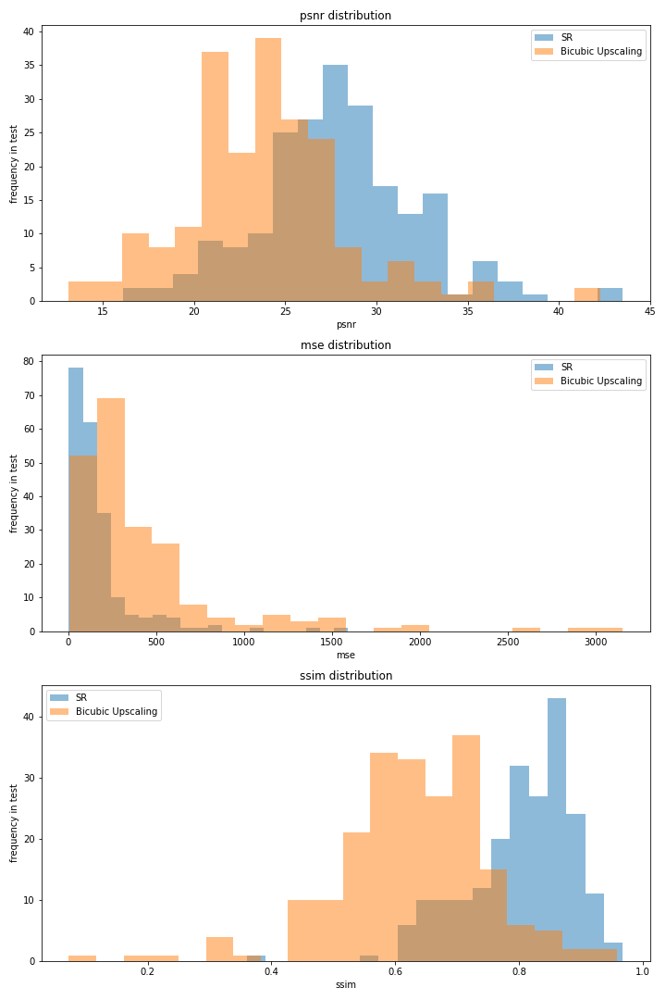

# sr4rs
Using SRResNet on UCMerced Landuse Dataset

## Model
SRResNet (https://arxiv.org/abs/1609.04802), as implemented at https://github.com/sgrvinod/a-PyTorch-Tutorial-to-Super-Resolution

## Dataset
http://weegee.vision.ucmerced.edu/datasets/landuse.html

"[...] USGS National Map Urban Area Imagery collection for various urban areas around the country."

Resolution of 1px = 1ft.

21 classes, each 100  images, *mostly* 256x256 images

## Preprocessing
For downsampling, I chose a 2px Gaussian Blur followed by an 1/4-scaling using nearest neighbour as this seemed a good trade of between ease-of-implementation, staying close to the method suggested in the paper and a 'physically plausible' resolution degregation.

Training was done using randomly to 96x96px cropped and randomly flipped images as ground truth and downscaled to 24x24px images as input.

## Training
### Parameters

|Parameter     | Value|
---------------| -----| 
| batchsize    | 64   | 
| optimizer    | ADAM | 
| learning rate| 1e-4 | 
| iterations   | 1e5  | 

### Progress
#### Training on UCMerced

#### Using prelearned weights and training on UCMerced

## Results
Image Quality assesment using MSE, PSNR and SSIM (https://en.wikipedia.org/wiki/Structural_similarity) on the 210 images using the original 256x256px ground truth and downsampled to 64x64px as input.

|          | MSE     | PSNR     | SSIM      |
|----------|---------|----------|-----------|
| Bicubic  | 420±460 | 23.8±4.4 | 0.63±0.12 |
| UCMerced | 180±220 | 27.6±4.2 | 0.79±0.09 |
| Sgrvinod | 320±360 | 25.0±4.3 | 0.69±0.12 |
| Transfer | 170±210 | 27.9±4.3 | 0.80±0.09 |

### Histograms of quality metrics
#### Training on UCMerced

#### Using sgrvinod's prelearned weights

#### Using prelearned weights and training on UCMerced

### Example images

### Discussion
